These are the images that I generated using the ray tracer I wrote as my final project for CS 488
(Introduction to Computer Graphics) offered at the University of Waterloo. I took the course in the Spring 2017 term
with Professor Gladimir Baranoski.

My ray tracer needed to demonstrate ten distinct features, each referred to as an objective. They are listed below
along with the generated image(s) that demonstrate the feature in question. Click on each image to enlarge it.

### Objective 1 -- Primitives -- Cylinder and Cone

A cylinder and cone primitive were added. These can be arbitrarily transformed using hierarchical transformations.

  

### Objective 2 -- Constructive Solid Geometry (CSG)

Using constructive solid geometry, primitives can be combined together using union, intersection, and difference
operations. The primitives can be combined arbitrarily by composing the CSG operations together in a tree, allowing for
creating complex models.

  <a href="images/obj2-csg-1.png" data-lightbox="obj2" data-title="Primitives can be combined using an arbitrary number of intersections, difference, and union operations.">
    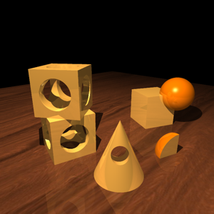
  </a>
  <a href="images/obj2-csg-2.png" data-lightbox="obj2" data-title="The outer rim of a globe, constructed out of primitives by using CSG.">
    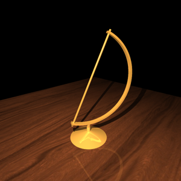
  </a>

### Objective 3 -- Refraction

Refraction occurs when light travels between different mediums where it either slows down or speeds up, which results
in interesting effects depending on the geometry of the primitive. Each primitive can be transparent, but the images
below just show transparent spheres and cubes.

  <a href="images/obj3-refraction175.png" data-lightbox="obj3" data-title="The transparent objects have an index of refraction of 1.75, which is similar to sapphire.">
    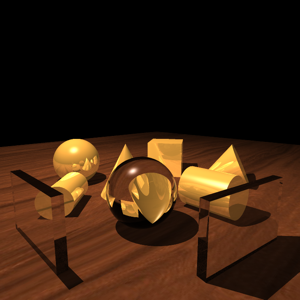
  </a>
  <a href="images/obj3-refraction242.png" data-lightbox="obj3" data-title="The transparent objects have an index of refraction of 2.42, which is similar to diamond.">
    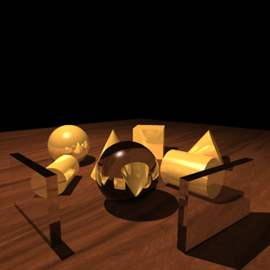
  </a>

### Objective 4 -- Texture Mapping

Every primitive can be textured. Each face on the primitive can also be independently textured. Texture mapping is
performed by mapping the surface intersection point on the primitive to UV coordinates, which are then mapped to the
texture.

  <a href="images/obj4-texture.png" data-lightbox="obj4" data-title="Each primitive and each face can be independently textured.">
    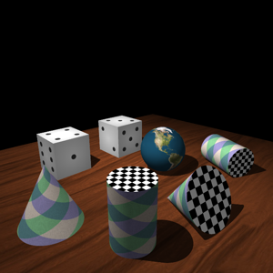
  </a>

### Objective 5 -- Bump Mapping

Bumps on a surface can be simulated by perturbing the surface normal according to a provided bump map. Then when
lighting calculations are performed, shadows are cast on the surface to simulate roughness even though the surface
itself is not deformed. Bump mapping can be combined with texture mapping to create more realistic looking objects.

  <a href="images/obj5-bump-left.png" data-lightbox="obj5" data-title="Bump map with a light source off to the left.">
    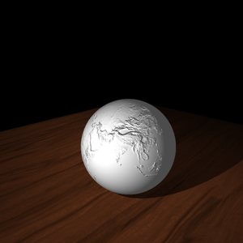
  </a>
  <a href="images/obj5-bump-right.png" data-lightbox="obj5" data-title="Bump map with a light source off to the right.">
    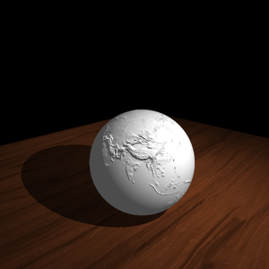
  </a>
  <a href="images/obj5-bump-earth-left.png" data-lightbox="obj5" data-title="Bump map combined with a texture. The light source is off to the left.">
    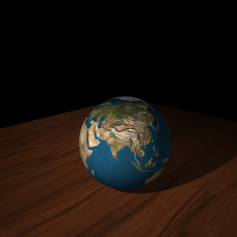
  </a>
  <a href="images/obj5-bump-earth-right.png" data-lightbox="obj5" data-title="Bump map combined with a texture. The light source is off to the right.">
    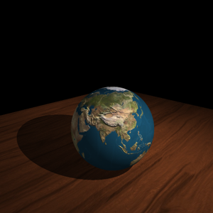
  </a>

### Objective 6 -- Anti-aliasing using Adaptive Supersampling

Without applying anti-aliasing techniques the generated images can look jagged, especially at low resolutions. However
supersampling every pixel is expensive, especially when the pixel is not on an "edge". Adaptive supersampling is
performed by initially sampling each pixel 4 times and only performing more sampling if the colours of the four samples
differ by some threshold amount.

  <a href="images/obj6-aliasing-with.png" data-lightbox="obj6" data-title="An image without adaptive supersampling. Aliasing is visible.">
    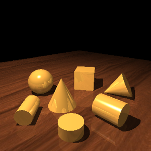
  </a>
  <a href="images/obj6-aliasing-edges-0.05.png" data-lightbox="obj6" data-title="Edges detected using adaptive supersampling are shown in red. A threshold of 0.05 was used.">
    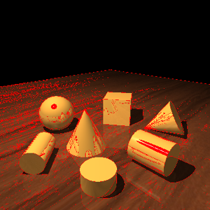
  </a>
  

### Objective 7 -- Soft Shadows

Point light sources create harsh rigid shadows. To simulate the soft shadow effect given off by an area light multiple
shadow rays are traced per intersection to random spots on the area light, with the result averaged.

  <a href="images/obj7-softshadows-point.png" data-lightbox="obj7" data-title="A scene with a point light and hard shadows.">
    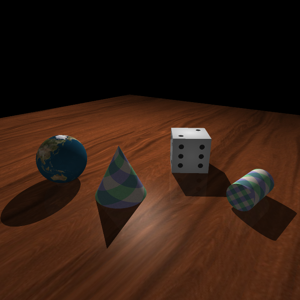
  </a>
  <a href="images/obj7-softshadows-area.png" data-lightbox="obj7" data-title="The same scene with an area light and soft shadows.">
    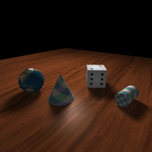
  </a>

### Objective 8 -- Depth of Field

Rays are normally cast from a single point. To simulate a depth of field effect rays can instead be cast from an area,
which mimics a camera aperture. Rays can be made to all converge at a specified focal distance, which is where the
image will appear to be in focus. The larger the aperture, the shorter the depth of field (distance where the image
appears in focus).

  <a href="images/obj8-dof-all.png" data-lightbox="obj8" data-title="A scene where each object is in focus.">
    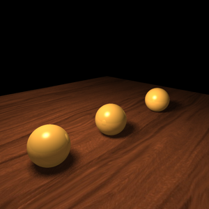
  </a>
  <a href="images/obj8-dof-near.png" data-lightbox="obj8" data-title="The near object is in focus.">
    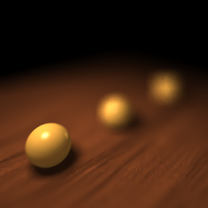
  </a>
  <a href="images/obj8-dof-middle.png" data-lightbox="obj8" data-title="The middle object is in focus.">
    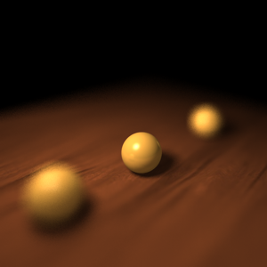
  </a>
  <a href="images/obj8-dof-far.png" data-lightbox="obj8" data-title="The far object is in focus.">
    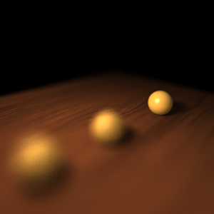
  </a>

### Objective 9 -- Glossy Reflection

Glossy reflection is simulated by randomly perturbing the reflected ray direction. The more glossy the object, the more
a reflected ray can be perturbed. This gives a blurred reflection effect.

  
  <a href="images/obj9-glossy.png" data-lightbox="obj9" data-title="Glossy mirrors showing a blurred reflection.">
    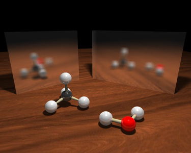
  </a>

### Objective 10 -- Final Scene

All features (except depth of field) were combined to create this final scene. It depicts chemical ball-and-stick
models for water and methane as well as a globe model.

  <a href="images/obj10-finalscene.png" data-lightbox="obj10">
    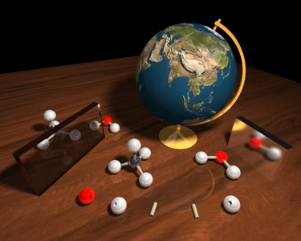
  </a>

### Extra Feature -- Multithreading

Multithreading was added to decrease rendering times. The image is split into 25 x 25 pixel chunks, which are traced
using the threads that are available.

The scene for Objective 1 was rendered at a resolution of 300 by 300 pixels using 1, 2, 4, 8, 16, and 32 threads. The
time it took to render the scene was recorded and used to produce the chart below. This timing data was obtained on
gl14 in the graphics lab.

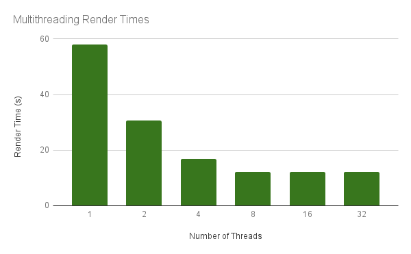
